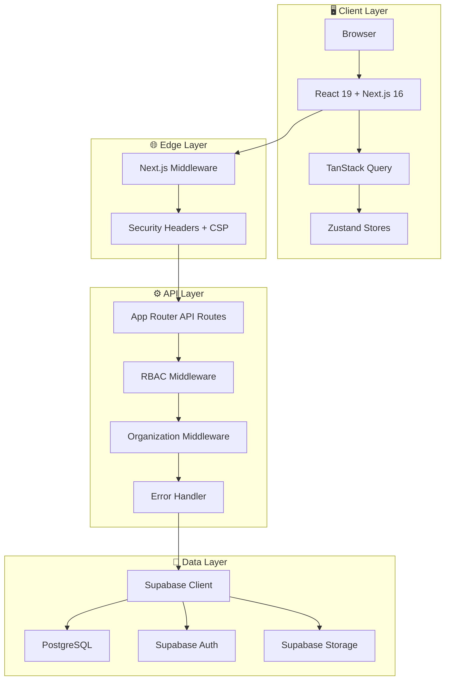
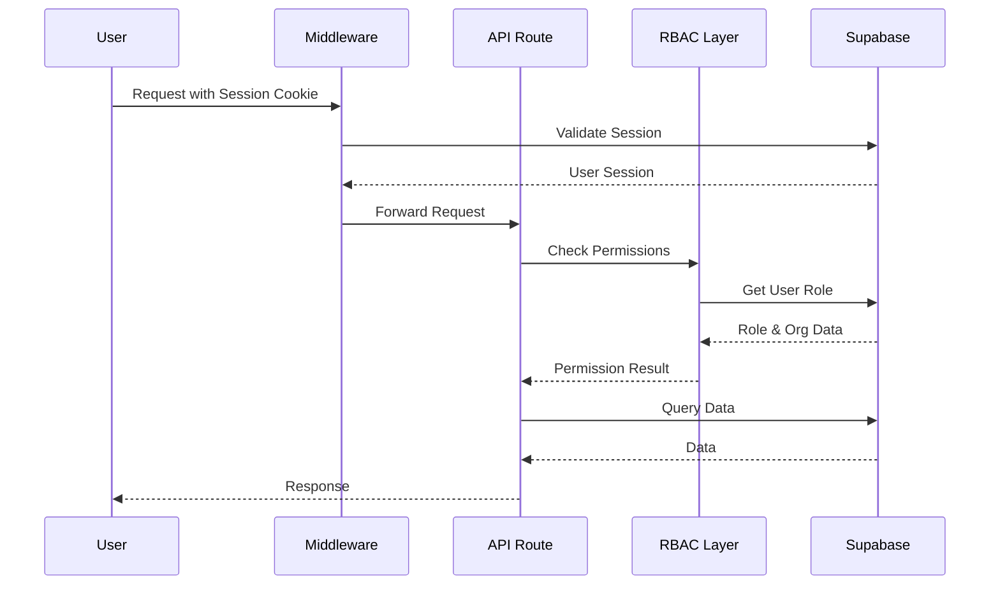
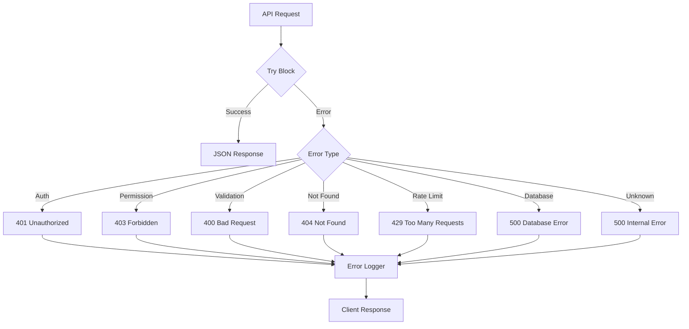

# Yardım Yönetim Paneli - Detaylı Mimari İnceleme Raporu

## 📋 Proje Özeti

Bu proje, **Yardım Yönetim Paneli** - sivil toplum kuruluşları için kapsamlı bir NGO (Non-Governmental Organization) yönetim sistemidir. Next.js 16 ve modern web teknolojileriyle geliştirilmiş, multi-tenant yapıya sahip, enterprise-grade bir uygulamadır.

---

## 🏗 Mimari Genel Bakış



---

## 🛠 Teknoloji Stack

| Katman | Teknolojiler | Versiyon |
|--------|-------------|----------|
| **Framework** | Next.js | 16.1.3 |
| **UI Library** | React | 19.2.3 |
| **Language** | TypeScript | 5.x |
| **Styling** | Tailwind CSS | 3.4.19 |
| **UI Components** | Radix UI | Latest |
| **Animations** | Framer Motion | 12.27.0 |
| **Icons** | Lucide React | 0.562.0 |
| **State Management** | Zustand | 5.0.10 |
| **Data Fetching** | TanStack Query | 5.90.17 |
| **Backend** | Supabase | 2.90.1 |
| **Forms** | React Hook Form + Zod | 7.71.1 + 3.25.76 |
| **Tables** | TanStack Table | 8.21.3 |
| **Monitoring** | Sentry | 10.37.0 |
| **Testing** | Vitest | 4.0.17 |

---

## 📦 Dashboard Modülleri (15+ Modül)

| Modül | Açıklama | İkon |
|-------|----------|------|
| **Ana Sayfa** | Dashboard istatistikleri | 🏠 |
| **İhtiyaç Sahipleri** | Kişi kayıt ve takip | 👥 |
| **Bağış Yönetimi** | Nakit, kurban, kumbara | 💰 |
| **Yetim & Burs** | Öğrenci ve sponsor takibi | 👶 |
| **Finans** | Kasa, banka, raporlar | 📈 |
| **Gönüllüler** | Gönüllü yönetimi | 🤝 |
| **Görevler** | Görev atama ve takip | ✅ |
| **Mesajlar** | SMS ve toplu mesaj | 💬 |
| **Envanter** | Depo ve stok yönetimi | 📦 |
| **Satın Alma** | Talep ve cari hesaplar | 🛒 |
| **Takvim** | Etkinlik ve toplantı | 📅 |
| **Üyelik** | Üye ve aidat takibi | 👤 |
| **Programlar** | Proje yönetimi | 📋 |
| **Ayarlar** | Sistem yapılandırma | ⚙️ |

---

## 🔐 Güvenlik Mimarisi

### 1. Authentication & Authorization Flow



### 2. RBAC Sistemi

**Roller (Hiyerarşik):**
```
owner (Tüm yetkiler)
  └── admin (Yönetim yetkileri)
      └── moderator (İçerik yönetimi)
          └── user (Temel yetkiler)
              └── viewer (Sadece görüntüleme)
```

**İzin Türleri:**
- `org:*` - Organizasyon yönetimi
- `members:*` - Üye yönetimi
- `data:*` - CRUD operasyonları
- `reports:*` - Raporlama
- `settings:*` - Ayarlar

### 3. Multi-Tenant Güvenlik

- **Organizasyon izolasyonu**: Her veri `organization_id` ile filtrelenir
- **Subscription kontrolü**: Abonelik durumu kontrol edilir
- **Header-based org seçimi**: `x-organization-id` header desteği

### 4. Security Headers

```typescript
// CSP (Content Security Policy) - Nonce-based
Content-Security-Policy: default-src 'self'; script-src 'self' 'nonce-xxx'

// Diğer güvenlik başlıkları
X-Frame-Options: DENY
X-Content-Type-Options: nosniff
Strict-Transport-Security: max-age=31536000
Referrer-Policy: strict-origin-when-cross-origin
```

---

## ⚙️ API Mimarisi

### Route Handler Pattern

```typescript
// app/api/needy/route.ts
export async function GET(request: NextRequest) {
  // 1. Auth kontrolü
  const authResult = await withAuth(request, {
    requiredPermission: 'read',
    resource: 'needy_persons',
  })
  if (!authResult.success) return authResult.response!

  // 2. Rate limiting
  const rateLimitResult = await rateLimit(request, {...})
  if (!rateLimitResult.success) return createRateLimitResponse(...)

  // 3. Query params
  const { searchParams } = new URL(request.url)
  const page = Number.parseInt(searchParams.get('page') || '0')
  
  // 4. Database query
  const supabase = await createServerSupabaseClient()
  const { data, error, count } = await supabase
    .from('needy_persons')
    .select('*', { count: 'exact' })
    .range(page * limit, (page + 1) * limit - 1)

  // 5. Response
  return NextResponse.json({ data, meta: { page, limit, count } })
}
```

### API Endpoint Listesi

| Endpoint | Method | Açıklama |
|----------|--------|----------|
| `/api/needy` | GET/POST | İhtiyaç sahipleri CRUD |
| `/api/donations` | GET/POST | Bağış kayıtları |
| `/api/dashboard/stats` | GET | Dashboard istatistikleri |
| `/api/auth/login` | POST | Authentication |
| `/api/meetings/*` | CRUD | Toplantı yönetimi |
| `/api/tasks/*` | CRUD | Görev yönetimi |
| `/api/programs/*` | CRUD | Program yönetimi |
| `/api/inventory/*` | CRUD | Envanter yönetimi |
| `/api/mernis/verify` | POST | MERNIS doğrulama |
| `/api/messages/*` | POST | SMS/Email gönderimi |

---

## 🧩 Component Mimarisi

### Klasör Yapısı

```
src/components/
├── ui/                    # Radix UI temel bileşenler
│   ├── button.tsx
│   ├── dialog.tsx
│   ├── form.tsx
│   └── ...
├── layout/                # Layout bileşenleri
│   ├── sidebar.tsx
│   ├── header.tsx
│   ├── mobile-menu.tsx
│   └── mobile-bottom-nav.tsx
├── forms/                 # Form bileşenleri
│   ├── needy-form.tsx
│   ├── donation-form.tsx
│   └── orphan-form.tsx
├── needy/                 # Domain-specific
│   ├── AddNeedyModal.tsx
│   └── detail/
│       ├── BasicInfoForm.tsx
│       └── tabs/
├── common/                # Ortak kullanılan
│   ├── data-table.tsx
│   ├── page-header.tsx
│   └── loading-skeleton.tsx
└── providers.tsx          # App providers
```

### UI Bileşen Örneği (Button)

```typescript
// class-variance-authority ile variant yönetimi
const buttonVariants = cva(
  "inline-flex items-center justify-center...",
  {
    variants: {
      variant: {
        default: "bg-primary text-primary-foreground...",
        destructive: "bg-danger text-white...",
        outline: "border border-input bg-background...",
        secondary: "bg-secondary...",
        ghost: "hover:bg-muted...",
        link: "text-primary underline-offset-4...",
        accent: "bg-accent text-white...",
      },
      size: {
        default: "h-10 px-4 py-2",
        sm: "h-9 rounded-md px-3 text-xs",
        lg: "h-11 rounded-lg px-6 text-base",
        icon: "h-10 w-10",
      },
    },
  }
)
```

---

## 🎯 State Management

### Zustand Store

```typescript
// stores/ui-store.ts
interface UIState {
  sidebarCollapsed: boolean
  mobileMenuOpen: boolean
  theme: 'light' | 'dark'
  toggleSidebar: () => void
  setMobileMenuOpen: (open: boolean) => void
}
```

### TanStack Query Configuration

```typescript
// src/components/providers.tsx
const queryClient = new QueryClient({
  defaultOptions: {
    queries: {
      staleTime: 10 * 60 * 1000,        // 10 dakika
      gcTime: 30 * 60 * 1000,           // 30 dakika
      retry: 2,                          // 2 retry
      refetchOnWindowFocus: false,       // Performans için kapalı
      refetchOnMount: false,             // Cache'den oku
    },
    mutations: {
      retry: 1,
      retryDelay: 1000,
    },
  },
})
```

---

## 🚨 Error Handling Sistemi

### Custom Error Sınıfları

```typescript
// lib/errors.ts
class AppError extends Error {
  constructor(
    message: string,
    public code: string,
    public statusCode: number = 500,
    public details?: Record<string, unknown>,
    public severity: ErrorSeverity = ErrorSeverity.MEDIUM,
    public recoveryActions?: RecoveryAction[],
    public errorType: ErrorType = ErrorType.UNKNOWN
  )
}

class AuthError extends AppError { ... }
class AuthorizationError extends AppError { ... }
class ValidationError extends AppError { ... }
class NotFoundError extends AppError { ... }
class RateLimitError extends AppError { ... }
class DatabaseError extends AppError { ... }
```

### Error Handling Flow



---

## 📊 Veritabanı Şeması (Supabase)

### Ana Tablolar

| Tablo | Açıklama | Anahtar Alanlar |
|-------|----------|-----------------|
| `needy_persons` | İhtiyaç sahipleri | id, first_name, last_name, identity_number |
| `donations` | Bağış kayıtları | id, donor_name, amount, donation_type |
| `orphans` | Yetim kayıtları | id, first_name, last_name, school_info |
| `volunteers` | Gönüllüler | id, name, phone, skills |
| `aid_applications` | Yardım başvuruları | id, needy_person_id, status |
| `inventory_items` | Envanter | id, name, quantity, warehouse_id |
| `finance_transactions` | Finans işlemleri | id, type, amount, category |
| `meetings` | Toplantılar | id, title, meeting_date, status |
| `tasks` | Görevler | id, title, assigned_to, status |
| `programs` | Programlar | id, name, start_date, end_date |
| `audit_logs` | Denetim kayıtları | id, entity_type, action, created_by |
| `organizations` | Organizasyonlar | id, name, plan_tier, subscription_status |
| `organization_members` | Org üyelikleri | id, user_id, organization_id, role |

### Audit & Soft Delete

Tüm tablolarda standart alanlar:
- `id` - UUID primary key
- `created_at`, `updated_at` - Timestamp
- `created_by`, `updated_by` - User reference
- `is_active` - Soft delete flag
- `organization_id` - Multi-tenant isolation

---

## 🚀 Performance Optimizasyonları

### 1. Next.js Optimizasyonları

```typescript
// next.config.ts
const nextConfig = {
  // Image optimization
  images: {
    formats: ['image/avif', 'image/webp'],
    minimumCacheTTL: 60 * 60 * 24, // 24 saat
  },
  
  // Bundle optimization
  experimental: {
    optimizePackageImports: [
      'lucide-react',
      '@radix-ui/react-icons',
      'date-fns',
    ],
  },
  
  // Compression
  compress: true,
  poweredByHeader: false,
}
```

### 2. Data Fetching Optimizasyonları

- TanStack Query ile caching
- Stale-while-revalidate stratejisi
- Pagination (20 kayıt/sayfa)
- Selective data fetching

### 3. Code Splitting

```typescript
// Lazy loading örneği
const LazyComponent = dynamic(() => import('./HeavyComponent'), {
  loading: () => <Skeleton />,
  ssr: false, // Client-side only
})
```

---

## ✅ Güçlü Yönler

1. **Modern Tech Stack**: Next.js 16, React 19, cutting-edge teknolojiler
2. **Güvenlik**: CSP, RBAC, audit logging, rate limiting
3. **Multi-Tenant**: Organizasyon bazlı veri izolasyonu
4. **Type Safety**: Kapsamlı TypeScript kullanımı
5. **Error Handling**: Yapılandırılmış hata yönetimi
6. **Performance**: Caching, lazy loading, optimizasyonlar
7. **Responsive**: Mobile-first tasarım
8. **Accessibility**: ARIA desteği, keyboard navigation
9. **i18n Hazır**: Türkçe arayüz, çeviri altyapısı
10. **Test Altyapısı**: Vitest, testing-library entegrasyonu

---

## 🔧 İyileştirme Önerileri

### 1. Kısa Vadeli (Hemen yapılabilir)
- [ ] OpenAPI/Swagger dokümantasyonu
- [ ] API rate limiting dashboard
- [ ] Test coverage raporu
- [ ] Bundle size analizi

### 2. Orta Vadeli (Planlanmalı)
- [ ] Real-time özellikler (Supabase Realtime)
- [ ] Offline support (PWA)
- [ ] Advanced caching stratejileri
- [ ] Load balancing / CDN

### 3. Uzun Vadeli (Yol haritası)
- [ ] Micro-frontend mimarisi
- [ ] AI-powered analytics
- [ ] Multi-region deployment
- [ ] Advanced RBAC (attribute-based)

---

## 📄 Rapor Bilgisi

**Rapor Tarihi**: 2026-01-31  
**İnceleyen**: Kilo Code (Architect Mode)  
**Proje**: Yardım Yönetim Paneli v0.1.0  
**Tech Stack**: Next.js 16.1.3, React 19, TypeScript 5, Supabase  

---

*Bu rapor, projenin mimari yapısını, güvenlik önlemlerini ve kod organizasyonunu kapsamlı bir şekilde incelemektedir.*
